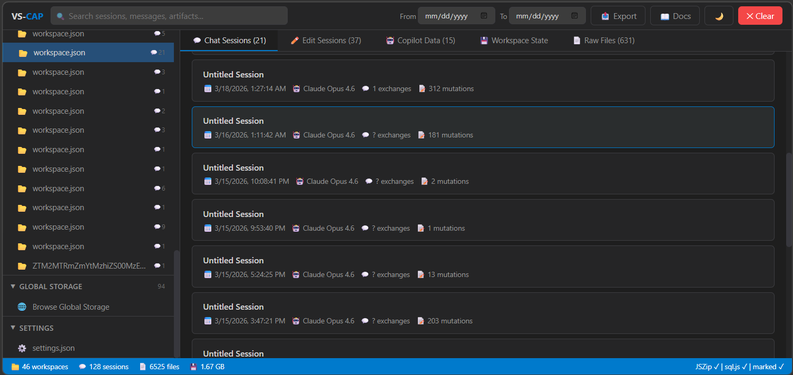

# VS-CAP — VSCode Session Chat Acquisition & Parsing

A forensic toolkit for collecting and analyzing VS Code workspace data, with a focus on AI/Copilot chat interactions.



## Quick Start

### Option 1 — Standalone HTML (no install)

Open `vs-cap-viewer.html` in any modern browser. Drop a ZIP or folder of collected VS Code data.

> The standalone viewer loads libraries from CDN on first use. For offline use, run `bundle-airgap.ps1` first or use the Docker setup.

### Option 2 — Docker (air-gapped)

```bash
docker compose up --build
```

Navigate to `http://localhost:8088`. All libraries are downloaded at build time — the running container needs no internet.

### Option 3 — KAPE

Copy `VSCode_WorkspaceStorage.tkape` into your KAPE `Targets` directory, then:

```
kape.exe --tsource C: --tdest E:\output --target VSCode_WorkspaceStorage
```

## Collecting Evidence

### PowerShell Collector (recommended)

```powershell
# All users, ZIP output
.\Collect-VSCodeData.ps1

# Specific user, custom output directory
.\Collect-VSCodeData.ps1 -Users <username> -OutputDir E:\evidence

# Keep raw folder instead of ZIP
.\Collect-VSCodeData.ps1 -NoZip
```

## What Gets Parsed

| Artifact | Location | Description |
|---|---|---|
| Chat Sessions | `chatSessions/*.jsonl` | Copilot conversations (JSONL mutation model) |
| Edit Sessions | `chatEditingSessions/*/state.json` | AI code editing timelines |
| Copilot Resources | `GitHub.copilot-chat/chat-session-resources/` | Tool invocation outputs |
| Agent Memory | `GitHub.copilot-chat/memory-tool/` | Persistent agent plans/notes |
| Workspace State | `state.vscdb` | SQLite key-value store (editor state) |
| Workspace Map | `workspace.json` | Hash-to-project-path mapping |
| Settings | `settings.json` | VS Code user configuration |

## Viewer Features

- **Conversation view** — Reconstructed chat sessions with user messages, AI responses, thinking blocks, and tool calls
- **Markdown rendering** — AI responses rendered with full Markdown support
- **Workspace state inspector** — Browse SQLite `state.vscdb` key-value pairs
- **File browser** — Navigate raw collected files
- **Search** — Full-text search across all sessions and artifacts
- **Date filtering** — Filter chat sessions by date range
- **Export** — JSON and CSV export for reporting
- **Dark/light theme** — Toggle between themes

## Security Notes

- **Read-only** — Source files are never modified. All parsing happens in-browser memory.
- **No data exfiltration** — Nothing is uploaded, stored in cookies, localStorage, or IndexedDB.
- **XSS protection** — Raw HTML in evidence data is escaped before rendering.
- **CSP enforced** — Docker deployment includes Content-Security-Policy headers.
- **Container hardened** — `read_only: true`, `no-new-privileges`, tmpfs mounts.
